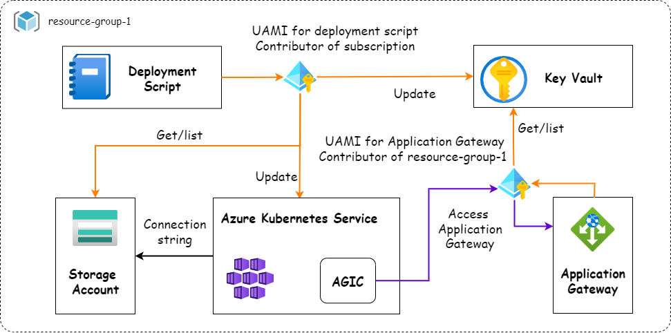
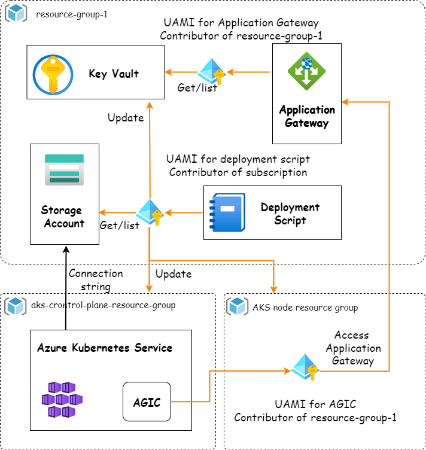

This sample is to demonstrate how to leverage Azure User Assigned Managed Identify (UAMI) to connect Azure resources; make those resources to serve as infrastructure that are able to run and expose Oracle WebLogic Server.  Including:

- Run Oracle WebLogic Server on AKS and expose WebLogic with Application Gateway Ingress Controller (AGIC)
- Store certificates in Key Vault and store WebLogic logs in Storage Account SMB file share
- Use UAMI to connect AGIC with Application Gateway
- Use UAMI to connect Application Gateway with Key Vault
- Use UAMI to connect Deployment Script with Azure resources

## Contents

- [Prerequisites](#prerequisites)
- [Run with Azure CLI](#run-with-azure-cli)
- [Design details](#design-details)
  - [Scenarios](#scenarios)
  - [Managed Identity and Roles](#managed-identity-and-roles)
  - [UAMI workflow](#uami-workflow)
- [Useful Bicep usage for role assignments](#useful-bicep-usage-for-role-assignments)


## Prerequisites

To deploy the sample, you must meet one of the following subscription permissions: 
- [Contributor](https://docs.microsoft.com/en-us/azure/role-based-access-control/built-in-roles#contributor) + [User Access Administrator](https://docs.microsoft.com/en-us/azure/role-based-access-control/built-in-roles#user-access-administrator) (Both are subscription roles, not AAD roles.)
- [Owner](https://docs.microsoft.com/en-us/azure/role-based-access-control/built-in-roles#owner)

## Run with Azure CLI

### Run the sample with a new AKS cluster

Create a resource group:

```bash
az group create -n javaee-on-azure-uami-prototype-rg -l eastus
```

Invoke the script:

```bash
az deployment group create -f mainTemplate.bicep -g javaee-on-azure-uami-prototype-rg
```

### Run the sample with an existing AKS cluster

Create a resource group:

```bash
az group create -n javaee-on-azure-uami-prototype-rg -l eastus
```

Create an AKS cluster

```bash
az aks create -g javaee-on-azure-uami-prototype-rg -n javaeeUamiTestWlsOnAks --enable-managed-identity
```

Invoke the script and specify the AKS cluster:

```bash
az deployment group create -f mainTemplate.bicep \
    -g javaee-on-azure-uami-prototype-rg \
    --parameters aksClusterName=javaeeUamiTestWlsOnAks aksClusterRGName=javaee-on-azure-uami-prototype-rg createAKSCluster=false
```

### Access application

URLs for test application: `http://<appgw-ip>/testwebapp/` and `https://<appgw-ip>/testwebapp/`

## Design details

### Scenarios

| Resources | Use Cases |
|---|---|
| AKS | 1. Create a new AKS with system managed identity enable. <br> 2. Support existing AKS cluster of different auth mode: <br> &nbsp; - User assigned managed identity. <br> &nbsp; - System assigned managed identity. <br> &nbsp; - Service principal |
| Key Vault| Auto generate a self-signed certificate for Application SSL/TLS termination, and store it in the key vault. |
| Application Gateway | 1. Expose workload with HTTP. <br> 2. Expose workload with HTTPS. |
| Storage | Enable AKS PV on a SMB file share. |

### Managed Identity and Roles

Here list key managed identity used in the prototype. Terms and phrases used in the table:

- Current resource group: the resource group that runs this sample, e.g. `javaee-on-azure-uami-prototype-rg`
- AKS Node resource group: the managed resource group ok AKS, e.g. `MC_javaee-on-azure-uami-prototype-rg_javaeeUamiTestWlsOnAks_eastus`

1. Managed Identity and roles used in the sample when creating a new AKS cluster.

| Managed Identity Name | Type | Role Assignments | Scope | Usage |
|---|---|---|---|------------|
| `wls-aks-application-gateway-user-defined-managed-itentity` | User Assigned | Contributor | Subscription | The identity is used for Deployment Script: <br> &nbsp; - To access and update AKS cluster for WebLogic deployment and ingress creation. <br> &nbsp; - To access and update key vault. |
| `wls-aks-application-gateway-user-defined-managed-itentity` | User Assigned | Contributor | Current resource group | 1. To connect Application Gateway and AGIC. <br> 2. To access key vault for SSL certificate of Application Gateway.  |

2. Managed Identity and roles used in the sample when bringing an existing AKS cluster

| Managed Identity Name | Type | Resource group |Role Assignments | Scope | Usage |
|---|---|---|---|------------|---|
| `wls-aks-application-gateway-user-defined-managed-itentity` | User Assigned | Current resource group | Contributor | Subscription | The identity is used for Deployment Script: <br> &nbsp; - To access and update existing AKS cluster for WebLogic deployment, network peering and ingress creation. <br> &nbsp; - To access and update key vault. |
| `wls-aks-application-gateway-user-defined-managed-itentity` | User Assigned | Current resource group| Contributor | Current resource group | 1. To access key vault for SSL certificate of Application Gateway.  |
| `ingressapplicationgateway-*` | User Assigned | AKS Node resource group | Contributor | Current resource group | 1. Connect ACIG and Application Gateway. |

Note: manged identity `ingressapplicationgateway-*` is created by command `az aks enable-addons -n ${NAME_AKS_CLUSTER} -g ${NAME_AKS_CLUSTER_RG} --addons ingress-appgw --appgw-id $appgwId`, the command does not support specifying a managed identity.

#### UAMI Workflow

- UAMI workflow of creating new AKS cluster



- UAMI workflow of bringing existing AKS cluster



## Useful Bicep usage for role assignments

1. Assign roles across resource group

    ```bicep
    module roleAssignment 'modules/_roleAssignmentCrossResourceGroup.bicep' = {
        name: 'assign-role'
        scope: resourceGroup(<your-resource-group-name>)
        params: {
            roleDefinitionId: roleDefinitionId
            principalId: principalId
        }
    }
    ```

1. Assign roles in subscription

    ```bicep
    module roleAssignment 'modules/_roleAssignmentinSubscription.bicep' = {
        name: 'assign-role'
        scope: subscription()
        params: {
            roleDefinitionId: roleDefinitionId
            principalId: principalId
        }
    }
    ```


